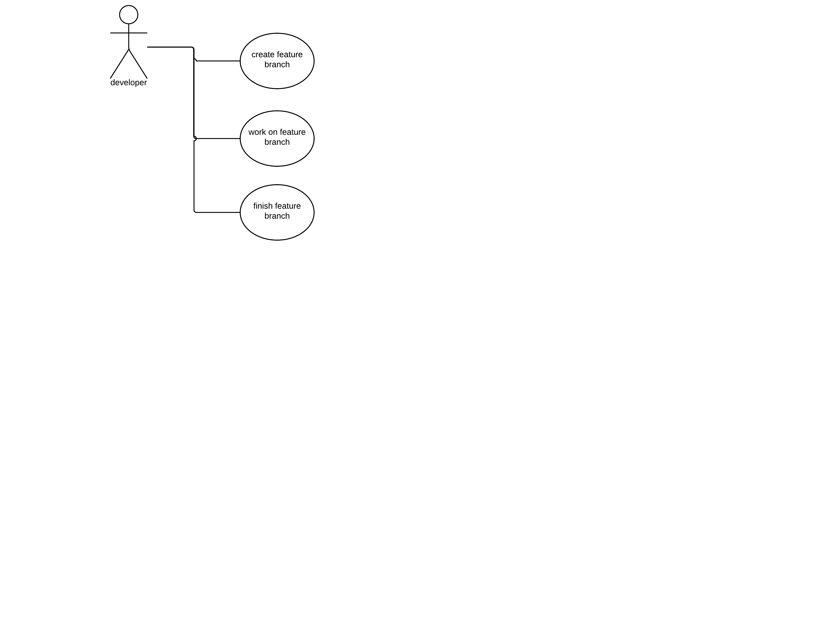
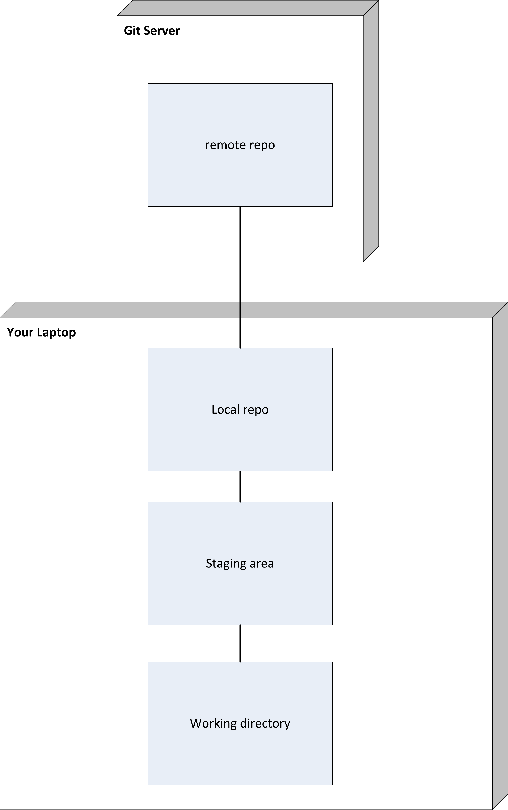
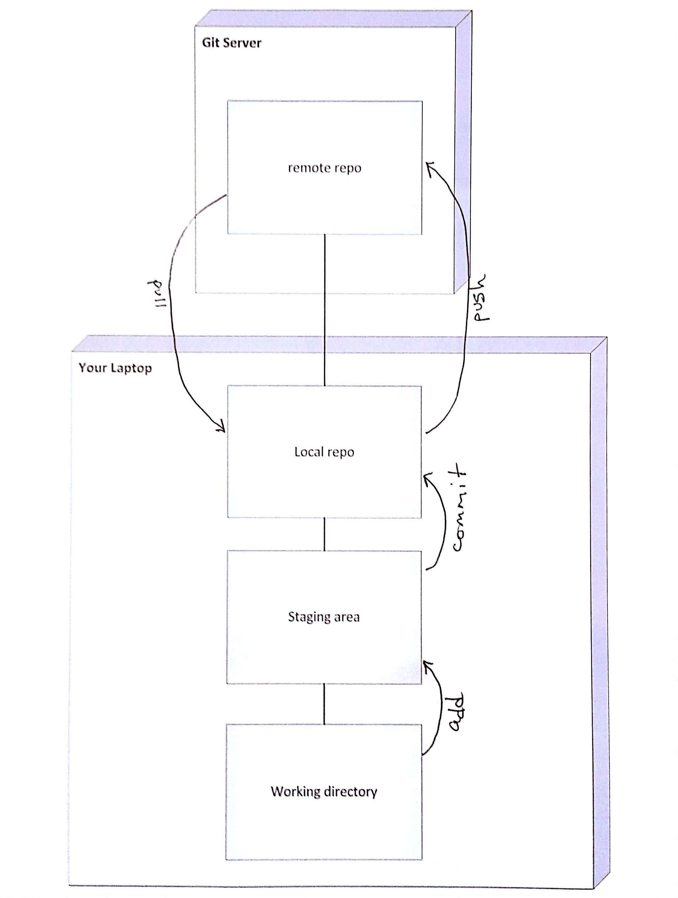
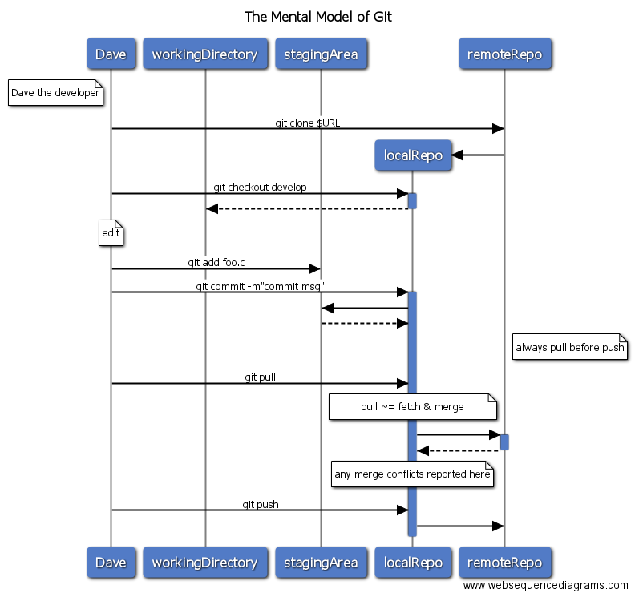
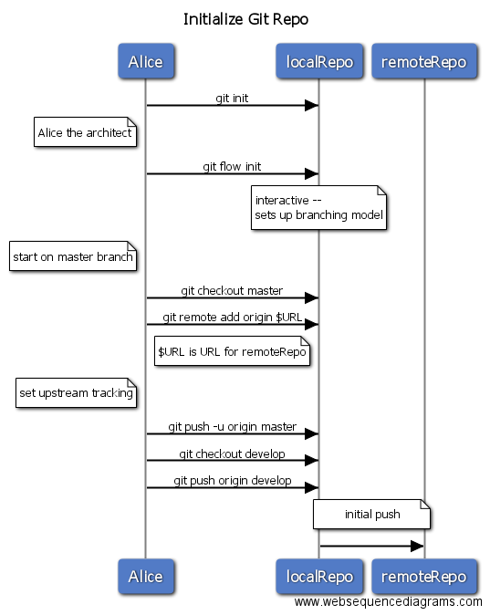
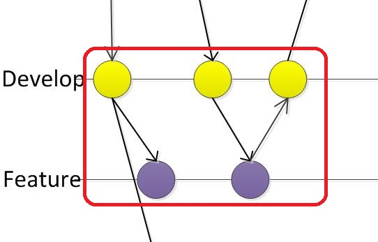
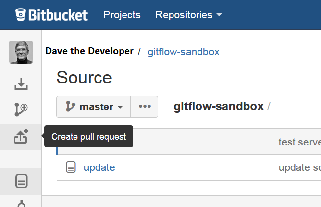
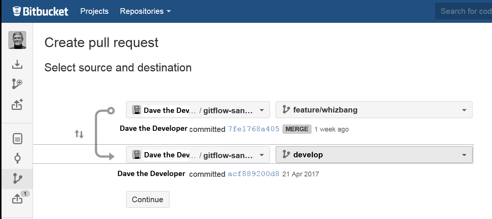

= Git & GitFlow Notes
Tim Born <Timothy.D.Born@JPMorgan.com>
v0.1, May 2017: DRAFT
:icons: font
:sectnums:
:toc: left
:url-bitbucket: http://tss4w2116:7990/projects/USCIS
:url-pro-git-book: https://git-scm.com/book/en/v2/

// I like the TOC on the left side.
// TODO:
// - 

TIP: When in Rome, do as the Romans do.

== Introduction
Git is a version control system.
Basically it is where we store documents, code, configuration settings, all kinds of things that we want to keep track of and _version_ as changes are made over time.

Git provides _many_ choices.  
This is an attempt to reduce git and gitflow to a small enough, usable subset.
The intended audience is people who are familiar with version control in general, possibly just getting started with git, looking to get their head around a workable solution for ~10 teams.

There are many books and papers that describe git and gitflow.  
This isn't meant to replace them, but to supplement them with project specifics.
In general, gitflow builds upon git, so you must master git first.
We are using _vanilla_ gitflow, so when in doubt, it's probably the simplest option.

[ NOTE ] 
====
Since gitflow builds on git, there are many ways you can go to accomplish the same result.
What I show are the gitflow commands on the command line.
They are just a convenient shorthand for multiple steps in git, and you may be using a GUI wrapper, which further hides things.  
You can install gitflow, but it's actually kind of slow, so find a solution that works for you.
====

=== Use Cases
One way to view this whole thing is through the lens of the different people (actors) and what they want to accomplish (goals).
For this I use a Use Case Diagram, like this:

TODO: get a MUCH better use case diagram!

You should be able to identify your role in there somewhere, and find the corresponding section that details the world from that point of view.

IMPORTANT: You may well have to operate in different roles at different times.

== The Zen of Git
Paulo Perrotta on Pluralsight did an outstanding job of explaining what really happens in git.  
I found that key to being able to manage git.  
The key point is the distinct areas: working directory, staging area and your (local) repository.  
The advanced class adds a stash area.  
Every git command operates on these areas; once you understand how they work together things become much more clear.

TODO: filter to remove branding on generated images

Note well your local repo is on your _local_ machine.  
You can commit all day and your collegues will not be able to collaborate.
Commits are _necessary_ but not sufficient.  You need to _push_ your changes to the central repo for collaboration.

The best thing you can do to really understand git is to walk through each of the common git commands and understand how it manipulates the working directory, the staging area, the local repo and the remote repo.
Once you do that you will have a much better chance of using git and not doing too much damage.

The other insight, especially if you come from other version control systems, is git is versioning a snapshot of the whole project, not a specific file.  
There is no send of locking files, checking them out & in, or tagging a file with a version number.
A version in git captures an entire filesystem -- all the files and directories -- at some point in time.

Be aware that _commit_ in git-speak is commiting to the repo on your local machine. 
Yes, you can commited your changes.
No, none of your colleagues can see those changes until you _push_ them to the central repo.  
You have been warned.

Here's a peek at how some of the most common git commands operate on the local and remote repositories.  See also https://git-scm.com/book/en/v2/Getting-Started-Git-Basics[git basics.]

=== Standard Branching Model in GitFlow

== Getting Started

== Scenario: Initialize Git Repository
scenario: initialize git repositry +
roles: architect +
goal: create git repo with suitable gitflow branches and policies

== Daily Cycle

[ TIP ]
_"Remember that code is really the language in which we ultimately express the requirements."_ +
- Uncle Bob Martin.

TODO: include better pix emphasizing bouncing between develop and feature branches

Dave the Developer has a daily cycle for creating new features.  
We assume you already know how Dave got his git set up.
If not, see section XXXXXXXXXXXX

The daily cycle looks something like this:

TODO: how do we show the pushes from local to remote repo, still on feature branch?

TODO: maybe number those arrows to correspond to the steps shown below?

That basically shows creating a new _feature_ branch from the _develop_ branch, writing the feature and finally completing the work, merging it into the _develop_ branch and killing off the _feature_ branch.  Let's look at that in more detail.

To start a new feature, Dave creates a _feature_ branch with a copy of the latest from _develop_ branch:
----
$ git flow feature branch start MyNewFeature
----

Periodically, when Dave has tested his code and sees that it doesn't break anything, he can (should) share (collaborate) by pushing his changes to the central repo.
Note that these changes are still on his _feature_ branch, but by being available on the central repo he can at least collaborate slightly better.

----
$ git add .
$ git commit -m "add new whizbit for MyNewFeature"
$ git pull
$ git push
----

TIP: _Always pull before you push._

The code is always changing, and by __pull__ing, you are fetching all those changes from the central repo to your local repo, followed by a _merge_.  This is where merge conflicts can show up, and you want to deal with them locally before you _push_ your changes up to the central repo.

The cycle of edit / commit / push continues until ...

When the feature is complete, it's time to merge the changes into the _develop_ branch.
This promotion, from _feature_ to _develop_, requires an inspection of two other people.
For production code, we use _pull requests_ to trigger these code inspections.  
A _pull request_ ends up looking like an email pointing to the specific changes being made.  
This is best done using the web interface, as shown below:

On the left edge, select "Create pull request".

This is where you select which branch you are proposing for the merge request.
In our case it will always be feature/<something> being merged into _develop_ branch.

TODO add URL for BitBucket {url-bitbucket}

Once the change is approved by two other people, Dave can merge his changes into _develop_, like this:

image::images/PullRequestMerge.png[Pull Request Merge]

NOTE: Code inspection by two other people is a project policy for all production code.  Other repos may relex this to a single inspector (or less), depending on the criticality of the code.

IMPORTANT: The longer you are on a _feature_ branch, the more the _develop_ branch will drift away and your colleagues will have less exposure to your work.  Therefore you want to push your work from the _feature_ branch to _develop_ frequently.

=== Scenario: Updating Your Copy of Your Repository

=== Scenario: Commiting Your Changes

=== Scenario: Pushing Your Changes to the Central Repository (BitBucket)
Always pull before you push.
This is where merge conflicts may happen.
How to resolve merge conflicts?

== Feature Branches

=== Scenario: Starting to Work on a New Feature
git flow feature start MyNewFeature

=== Scenario: Publishing Your Work So Others Can See
git flow feature publish

=== Scenario: Finishing Your Feature
git flow feature finish

== Pull Requests
Code that is intended to be merged with master (production), develop (the current version of all work), or release (a release candidate branch between develop and master) will require a _pull request_.

A _pull request_ looks like this XXXXXXX

You create a pull request HOW????

If you are asked to approve a pull request, review the submitted code changes carefully, add any comments and decide if you want to approve or reject.

When you _pull request_ has been approved (policy: by at least two reviewers) you can proceed to merge your changes.  HOW???

== Release Branches
actors: X, Y

create, finish, push

== Hot Fixes
actors: X, Y

create, finish, push

== Merge Conflicts
What are they?  How to resolve them?

== Other

TODO: get these admonitions to work correctly.

== If You Use git From The Command Line, It Will Often Give Useful And Explicit Advice

....
pleasant:git-notes timborn$ git commit -m "checkpoint progress -- adding some basic structure and MSCs"
[master 1e01051] checkpoint progress -- adding some basic structure and MSCs
 Committer: timborn <timborn@pleasant.local>
Your name and email address were configured automatically based
on your username and hostname. Please check that they are accurate.
You can suppress this message by setting them explicitly. Run the
following command and follow the instructions in your editor to edit
your configuration file:

    git config --global --edit

After doing this, you may fix the identity used for this commit with:

    git commit --amend --reset-author
....
