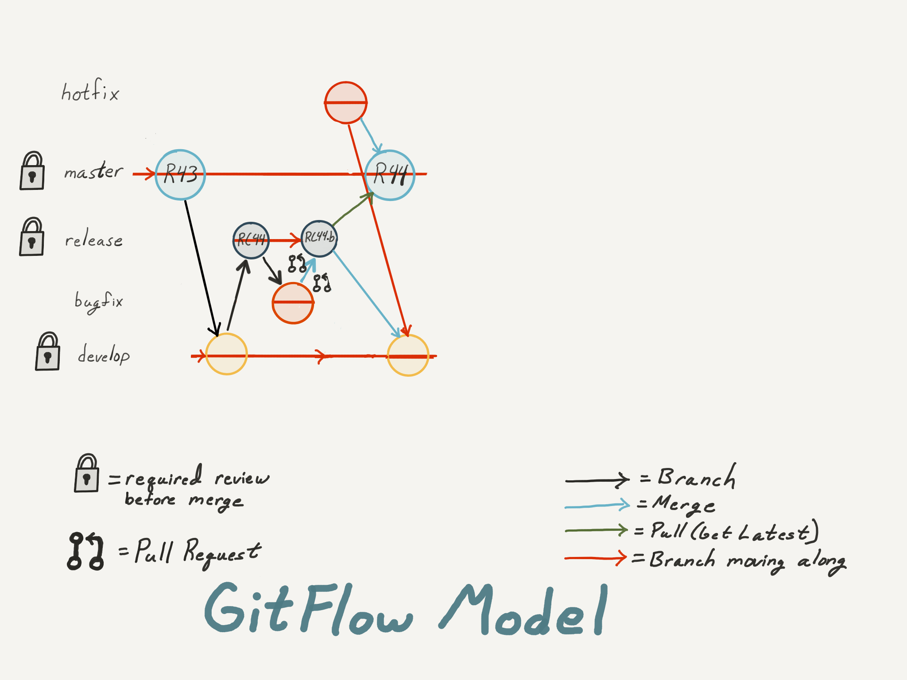

= Git & GitFlow Notes
Tim Born <Timothy.D.Born@JPMorgan.com>
v0.6, November 17, 2017: DRAFT
:doctype: book
:icons: font
:sectnums:
:toc: left
:url-bitbucket: http://tss4w2116:7990/projects
:url-cookbook: http://tss4w2116:7990/users/i495335/repos/cookbook
:url-gitflow-tools: http://tss4w2116:7990/projects/NON/repos/gitflow
:url-pro-git-book: https://git-scm.com/book/en/v2/

// I like the TOC on the left side.
// TODO:
// - 

== Introduction
Git is a version control system.
Basically, it is where we store documents, code, configuration settings, all kinds of things that we want to keep track of and _version_ as changes are made over time.

Git provides _many_ choices.  
This is an attempt to reduce git and GitFlow to a small enough, usable subset.
The intended audience is people who are familiar with version control in general, possibly just getting started with git, looking to get their head around a workable solution for ~10 teams.

There are many books and papers that describe git and GitFlow.  
This isn't meant to replace them, but to supplement them with project specifics.
In general, GitFlow builds upon git, so you must master git first.
We are using _vanilla_ GitFlow, so when in doubt, it's probably the simplest option.

=== About This Book
Since GitFlow builds on git, there are many ways you can go to accomplish the same result.
What I show are the GitFlow commands on the command line.
They are just a convenient shorthand for multiple steps in git, and you may be using a GUI wrapper, which further hides things.  
You can install GitFlow scripts, but they are actually kind of slow, so find a solution that works for you.
The Visual Studio GitFlow extension is a light wrapper around the same GitFlow scripts used at the command line, so they aren't any faster. 
Be patient.

Throughout the document we show snippets of the commands you would type if you are using _GitFlow_ from the command line, as shown below.  If you are new to using the command line, the '$' is the prompt, not something you need to type.
```
$ date
Tue Jun  6 07:35:06 CDT 2017
```

=== Acknowledgements
Thanks to Kevin Lynch for much of the art work, helping to clarify the effects of the operations on the branches.

Some of the art work was borrowed from the seminal GitFlow paper, http://nvie.com/posts/a-successful-git-branching-model/["A Successful Git Branching Model"] by Vincent Driessen.  
Vincent formalized a set of common patterns for groups working together using git, and it has become well established.

Thanks to Maria Muffoletto for her diligent editing.

=== Use Cases
One way to view this whole thing is through the lens of the different people (actors) and what they want to accomplish (goals).
For this, I use a Use Case Diagram, like this:


TODO: get a MUCH better use case diagram!

You should be able to identify your role in there somewhere, and find the corresponding section that details the world from that point of view.

IMPORTANT: You may well have to operate in different roles at different times.

== The Zen of Git
https://www.pluralsight.com/authors/paolo-perrotta[Paulo Perrotta on Pluralsight] did an outstanding job of explaining what really happens in git.  
I found that key to being able to manage git.  
The key point is the distinct areas: working directory, staging area, and your (local) repository.  
The advanced class adds a stash area.  
Every git command operates on these three areas; once you understand how they work together things become _much_ more clear.

A git version identifier identifies a unique state of the file system and all files within it.  It does not version files, but the entire repository.

// MARIA: This feels like too big of a jump from a high-level explanation of three areas of work and then getting into a git version identifier. I'd expect there will be three sections following this announcement of the three work spaces and that you'd explain them a little bit. Since further down you start to explain the three areas, it may be helpful to tell me here why you're mentioning this at all a git version identifier.

In git, _commit_ puts a copy into your local repository, but since it's local and hasn't left your machine, you are not yet sharing.  You need to understand and use _git push_ in order to collaborate effectively.

image::images/GitMentalModel.png[The Mental Model of Git, 528, 496]

Note well your local repo is on your _local_ machine.  
You can commit all day and your collegues will not be able to collaborate.
Commits are _necessary_ but not sufficient.  You need to _push_ your changes to the central repo for collaboration.

The best thing you can do to really understand git is to walk through each of the common git commands and understand how it manipulates the working directory, the staging area, the local repo and the remote repo.
Once you do that you will have a much better chance of using git and not doing too much damage.

The other insight, especially if you come from other version control systems, is git is versioning a snapshot of the whole project, _not a specific file_.  
There is no notion of locking files, checking them out & in, or tagging a file with a version number.
A version in git captures an entire filesystem -- all the files and directories -- at some point in time.

[IMPORTANT]
====
Be aware that _commit_ in git-speak is commiting to the repo on your local machine. 
Yes, you commited your changes.
No, none of your colleagues can see those changes until you _push_ them to the central repo.  
You have been warned.
====

Here's a peek at how some of the most common git commands operate on the local and remote repositories.  See also https://git-scm.com/book/en/v2/Getting-Started-Git-Basics[git basics.]


image::images/TheMentalModelofGit.png[The Zen of Git]


== The Zen of Git Flow

=== Standard Branching Model in GitFlow
This image comes from Vincent Driessen's paper, "A Successfull Git Branching Model".
Note the interaction among the various branches.
If you study this a bit, you will see a pattern appear: every _protected_ branch has one or more _creative_ branches feeding into it.
That pattern appears at least three times in this diagram.
Can you find them?

image::images/git-model@2x.png[The Standard GitFlow Model]

Throughout the document I use the notation of _feature/_ for a feature branch, _release/_ for a release branch, etc.  
The reason is in GitFlow, those are the prefixes that are commonly used.

== Getting Started
GitFlow is a set of policies and conventions implemented on top of git.
While it is possible to use GitFlow policies just using straight GitFlow, most people find that awkward.
There are a number of scripts and extensions that can help:

. GitFlow scripts (v0.4.1)
. GitFlow for Visual Studio 2013 (v 1.1.0.0)
. GitFlow for Visual Studio 2015 (v 1.1.0.0)

Each of these is found in the GitFlow repository in the NONPROD project on BitBucket.

== Scenario: Clone Git Repository
Cloning a git repo is the same for git & GitFlow.  
Nothing special here.

----
$ git clone  http://me@server/scm/prod/ABS.git
Cloning into 'ABS'...
Password for 'http://me@server':
remote: Counting objects: 352, done.
remote: Compressing objects: 100% (216/216), done.
remote: Total 352 (delta 122), reused 352 (delta 122)
Receiving objects: 100% (352/352), 3.75 MiB | 348.00 KiB/s, done.
Resolving deltas: 100% (122/122), done.
Checking connectivity... done.
----

== Scenario: Initializing A Repository For GitFlow
scenario: initialize git repositry +
roles: developer +
goal: create git repo with suitable GitFlow branches and policies

Initializing your local repo so it knows you intend to use GitFlow policies is essential, otherwise GitFlow refuses to work:

----
$ git flow feature
fatal: Not a GitFlow-enabled repo yet. Please run "git flow init" first.
----

When you clone a repository you get a local copy of the whole repo on your machine.
To use the GitFlow pattern, you will need to initialize it (once), as shown below.

----
$ git flow init
Initialized empty Git repository in /cygdrive/c/Users/me/ABS/.git/
No branches exist yet. Base branches must be created now.
Branch name for production releases: [master]
Branch name for "next release" development: [develop]
How to name your supporting branch prefixes?
Feature branches? [feature/]
Bugfix branches? [bugfix/]
Release branches? [release/]
Hotfix branches? [hotfix/]
Support branches? [support/]
Version tag prefix? []
Hooks and filters directory? [/cygdrive/c/Users/me/ABS/.git/hooks]
----

Take all the defaults for various branch names.

== Daily Cycle

[ TIP ]
_"Remember that code is really the language in which we ultimately express the requirements."_ +
- Uncle Bob Martin

TODO: include better pix emphasizing bouncing between develop and feature branches

Dave the Developer has a daily cycle for creating new features.  
We assume you already know how Dave got his git set up.
If not, see section XXXXXXXXXXXX

// MARIA: Don't forget to update the XXXXX above with whatever section it should be :) 

The daily cycle looks something like this:

image::images/DeveloperDailyCycle.jpg[The Developer Daily Cycle]

TODO: how do we show the pushes from local to remote repo, still on feature branch?

TODO: maybe number those arrows to correspond to the steps shown below?

That basically shows creating a new _feature_ branch from the _develop_ branch, writing the feature and finally completing the work, merging it into the _develop_ branch and killing off the _feature_ branch.  Let's look at that in more detail.

To start a new feature, Dave creates a _feature_ branch with a copy of the latest from _develop_ branch:
----
$ git flow feature branch start MyNewFeature
----

Periodically, when Dave has tested his code and sees that it doesn't break anything, he can (should) share (collaborate) by pushing his changes to the central repo.
Note that these changes are still on his _feature_ branch, but by being available on the central repo he can at least collaborate slightly better.

----
$ git add .
$ git commit -m "add new whizbit for MyNewFeature"
$ git pull
$ git push
----


TIP: _Always pull before you push._

The code is always changing, and by __pull__ing, you are fetching all those changes from the central repo to your local repo, followed by a _merge_.  This is where merge conflicts can show up, and you want to deal with them locally before you _push_ your changes up to the central repo.

The cycle of edit / commit / pull / push continues until ...

When the feature is complete, it's time to merge the changes into the _develop_ branch.
This promotion, from _feature_ to _develop_, requires an inspection by two other people.
For production code, we use _pull requests_ to trigger these code inspections.  
A _pull request_ ends up looking like an email pointing to the specific changes being made.  
This is best done using the web interface, as shown below:


On the left edge, select "Create pull request".

image::images/CreatingAPullRequest2.png[Creating a Pull Request]
This is where you select which branch you are proposing for the merge request.
In our case, it will always be feature/<something> being merged into _develop_ branch.

Once the change is approved by two other people, Dave can merge his changes into _develop_, like this:

image::images/PullRequestMerge.png[Pull Request Merge]

NOTE: Code inspection by two other people is a project policy for all production code.  Other repos may relax this to a single inspector (or less), depending on the criticality of the code.

IMPORTANT: The longer you are on a _feature_ branch, the more the _develop_ branch will drift away and your colleagues will have less exposure to your work.  Therefore you want to push your work from the _feature_ branch to _develop_ frequently.

=== Scenario: Updating Your Copy of Your Repository

It's a fact of life that someone will always work later than you and get up earlier than you, so when you start every morning, you would be well advised to _pull_ at least daily, if not more often.
In git, _pull_ is a combination of _fetch_ (from the central server) and _merge_.
This is where you refresh your local repository with all the changes that have been going on around you.

----
$ git pull
----

=== Scenario: Sharing Your Changes

While you are working on your feature, you are (hopefully) collaborating.
Since you cannot merge your changes from feature/ branch to develop/ branch until it's at least stable, how do you share?

Gitflow has the notion of _publish_ which makes your feature/ _branch_ visible on the server.
Your changes are still on a feature/ branch, and others can _pull_ and see those changes and collaborate with you, but your changes are not merged into develop/ until you are ready.

----
$ git flow feature publish MyNewFeature
----

If you are trying to collaborate with someone, you need to see a copy, so use some combination of:

----
$ git flow feature pull MyNewFeature
$ git flow feature track MyNewFeature
$ git flow feature checkout MyNewFeature
----

// MARIA: I would clarify what these mean since you said I can use "some combination of" them. 

== Feature Branches
If you are a developer working within the _GitFlow_ pattern, most of your interaction involves creating a feature branch, editing your code, publishing changes to your branch and eventually creating a pull request and finishing the feature branch.  
We walk through all those scenarios in this section.

[#img-sunset]
.A Developer's View
image::images/DeveloperFocus.png[Feature Branches]
// TODO: figure out how to get figure numbers somehow relative to section numbers
// or capture the figure number in a macro so I can refer to it later

This diagram shows the develop/ branch, which exists forever, and a couple of feature/ branches, which are created and then destroyed as features are created and merged into develop/.

=== Scenario: Starting to Work on a New Feature
Once you have a cloned repo and it has been initialized to understand the GitFlow pattern, you are ready to create a feature branch to work on.
```
$ git flow feature start MyNewFeature    # creates branch feature/MyNewFeature
```
In Figure 1, this represents the line from develop/ to feature/ indicating the creation of a new feature branch.

At this point you are probably on the correct branch, but you can check, like this:
```
$ git branch --list
  develop
* feature/MyNewFeature
  master
```
This tells you your edits and commits are on your feature branch.  
Start coding!

=== Scenario: Publishing Your Work So Others Can See
It is important to collaborate, so we share our code, even our feature branches, using the central repository.
Your code is not (yet) merged on to develop/ so it doesn't need a _pull request_ and approvers, but you do need to get a copy of your feature branch on the central server so others can collaborate.
In GitFlow, this is _publish_.
```
$ git flow feature publish 

...
Summary of actions:
- the remote branch 'feature/MyNewFeature' was created or updated
- the local branch 'feature/MyNewFeature' was configured to track the remote branch
- You are now on branch 'feature/MyNewFeature'
```

NB if/when you create a _pull request_ on the BitBucket web interface, you need to specify your feature/ branch.
For that to work, you will have needed to expose your feature/ branch to the server, and _git flow feature publish_ is a way to make that happen.


=== Scenario: Collaborating With Someone On A Feature Branch
TODO: how does 2nd person see and get a copy of a feature branch on central repo?

You can see all branches, both locally and on the central repository:
```
$ git branch --list -a
```

Per _GitFlow cheatsheet_ (https://danielkummer.github.io/git-flow-cheatsheet):
```
$ git flow feature pull origin MyNewFeature

# Good, but you also want to track changes so pull & push work as expected
$ git flow feature track MyNewFeature
```

=== Scenario: Finishing Your Feature
Normally you can wrap things up from the command line:
```
$ git flow feature finish MyNewFeature
$ git push
```
This merges feature/ into develop/ branch and kills off both local and remote copies of the feature/ branch.
Do not forget to push!  
The merge is still local to your machine until you push.

IMPORTANT: If you have _pull request_ policy in place, it becomes very difficult to finish your feature/ branch from the local command line.
While the merge will work, the subsequent push to sync develop/ on BitBucket will get rejected by the _pull request_ policy.

TODO: add image of BitBuget pull request completed w/ merge button 

There is a 'merge' button on BitBucket web interface where your _pull request_ is.
This will complete the merge, and the result will land in BitBucket.
You will still need to delete your branches and sync your local repo, however.
```
$ git checkout develop
$ git push origin --delete feature/WizBangFeature
$ git branch -d feature/WizBangFeature
$ git pull
```

This merges your feature/ branch into develop/ and deletes the feature/ branch.  
You end up on develop/ in your working directory.

While you can use the 'merge' button on the BitBucket website, this is slightly preferable.  See section XXX for details.

=== Scenario: What If We Have A GitFlow Policy Of Two Approvers?
As a way to ensure changes get multiple sets of eyes, it's possible to 'protect' a branch by requiring that the merge occur via _pull requests_.  
One common policy protecting production code takes this even further, requiring _two_ people approve the changes before the merge can occur.

But what if you forget (or try to step around the policy)?

----
$ git flow feature finish
Switched to branch 'develop'
Your branch is up-to-date with 'origin/develop'.
Updating acf8892..cfea370
Fast-forward
readme.txt | 2 ++
1 file changed, 2 insertions(+)
create mode 100644 readme.txt
remote: Kilroy was here (on the server)
To ssh://git@gitserver:7999/~iwannasid/gitflow-sandbox.git
- [deleted]         feature/01-make-ockert-happy
Deleted branch feature/01-make-ockert-happy (was cfea370).
 
Summary of actions:
- The feature branch 'feature/01-make-ockert-happy' was merged into 'develop'
- Feature branch 'feature/01-make-ockert-happy' has been locally deleted; it has been remotely deleted from 'origin'
- You are now on branch 'develop'
 
 
$ ### looks good so far ... says it merged to develop ... killed off my branch ...
$ git branch
* develop
  master
 
$ git status
On branch develop
Your branch is ahead of 'origin/develop' by 1 commit.
  (use "git push" to publish your local commits)
nothing to commit, working directory clean
 
$ git pull
remote: Counting objects: 2, done.
remote: Compressing objects: 100% (2/2), done.
remote: Total 2 (delta 0), reused 0 (delta 0)
Unpacking objects: 100% (2/2), done.
From ssh://gitserver:7999/~iwannasid/gitflow-sandbox
   acf8892..3dfda19  develop    -> origin/develop
   d350f8a..afc18b4  master     -> origin/master
Merge made by the 'recursive' strategy.
foo                 | 4 +---
update              | 2 ++
words-of-wisdom.txt | 2 ++
3 files changed, 5 insertions(+), 3 deletions(-)
create mode 100755 update
create mode 100644 words-of-wisdom.txt
 
$ git push
Counting objects: 5, done.
Delta compression using up to 8 threads.
Compressing objects: 100% (5/5), done.
Writing objects: 100% (5/5), 709 bytes | 0 bytes/s, done.
Total 5 (delta 0), reused 0 (delta 0)
remote:                             *%%%%%.
remote:                         %%%         %%%
remote:                      ,%#               %%
remote:                     %%                   %%
remote:                    %#                     %%
remote:                   %%                       %
remote:                   %(                       %%
remote:                   %%%%%%%%%%%%%%%%%%%%%%%%%%%
remote:                 %#%*%#///////%# %%///////%%%%%%
remote:                ,% %*%%******%#   %%******%(%%,%
remote:                  %%/ %%/**%%/%%%%%%%(**#%( %%#
remote:                   %%          %%%          %(
remote:                    %                      .%
remote:                    *%        %%%%%       .%
remote:                      %#                 %%
remote:                       .%%            .%%
remote:                       .%%.%%,     %%%.%%/
remote:                 %%%%%%##%.  #%%%%%.  .%((%%%%%%
remote:             %%#(((((((((%%,         #%%(((((((((#%%.
remote:       %%%((((((((((((((((((%%%, .%%%((((((((((((((((((#%%*
remote:     %%(((((((((((((((((((((((((%(((((((((((((((((((((((((#%.
remote:   ,%(((((((((((((((((((((((((((((((((((((((((((((((((((((((%#
remote:   %#((((((((((((((((((((((((((((((((((((((((((((((((((((((((%
remote:   %%%%%%%%%%%%%(((((((((((((((((((((((((((((((((%%%%%%%%%%%%%
remote:  %%            %####((((((###%%%%%%%%#(((((((((%            ,%
remote: ,%             %%%%%%#.               %%%((((((%*            %%
remote: #%                                       %%%#                %%
remote: .%                             .%%%%%%%%%                    %#
remote:  %                         #%%%                              %
remote:  %                     %%%%                                  %*
remote: /%************/#%%%%%%######%%*                        ..,*/(%%
remote:               %%######(((((((##################%%
remote:               %%######(((((((((((((((((((((((((%%
remote: //////////////%%%%%%%%#########################%%/////////  ///
remote: ----------------------------------------------------
remote: Branch refs/heads/develop can only be modified through pull requests.
remote: Check your branch permissions configuration with the project administrator.
remote: ----------------------------------------------------
remote:
To ssh://git@gitserver:7999/~iwannasid/gitflow-sandbox.git
! [remote rejected] develop -> develop (pre-receive hook declined)
error: failed to push some refs to 'ssh://git@gitserver:7999/~iwannasid/gitflow-sandbox.git'
----

The gitflow policy is enforced on the server.
So while it _did_ merge my changes with the develop/ branch, those changes are only local to my machine, and I have no way to push them to the server.

Your changes are not lost, but unwinding them may be interesting.
It is an exercise left to the reader to determine how to reverse the merge to develop/ to extract the changes from the feature/ branch so you can try again using a _pull request_.

Hint:

. When git told us it deleted our feature/ branch, it told us _exactly_ which branch that was (`Deleted branch feature/01-make-ockert-happy (was cfea370)`).
. Git garbage collects old nodes ... eventually, so if you know the exact name of a node, you might be able to catch it if you act before the garbage collector.
. Moving HEAD backward in time is straightward, so we can move the mainline "back in time".

== Pull Requests
Code that is intended to be merged with master (production), develop (the current version of all work), or release (a release candidate branch between develop and master) will require a _pull request_.

=== Creating A Pull Request

TODO: finish me

=== Reviewing A Pull Request 
The web interface for pull requests is pretty good, but sometimes you want to pull in the changed code and play with it.  The steps below show how to get a copy.
----
$ git checkout develop	# get back on develop/ branch
$ git pull		# get latest
$ git checkout -t origin/feature/foobar		# -t to Track this branch
$ # any subsequent checkouts of this branch would not need -t
----

A _pull request_ looks like an email.  
It is generated using the BitBucket website ({url-bitbucket}).
The email includes a link so people can review the changes made, add comments and (hopefully) approve your changes.

// MARIA: Don't forget to add a screenshot. 


// MARIA: I think you covered this above, but feel free to elaborate again - probably wouldn't hurt.

If you are asked to approve a pull request, review the submitted code changes carefully, add any comments, and decide if you want to approve or reject.

When your _pull request_ has been approved, (policy: by at least two reviewers) you can proceed to merge your changes.  HOW???

// MARIA: By clicking the merge button! A+ for Maria

== Exercise #1 - Be A Developer
_"Be the ball."_ - Ty Webb (Chevy Chase), Caddyshack

At this point you know enough to be able to demonstrate what a developer's life looks like, bouncing between feature/ and develop/ branches.

For this exercise we will build a cookbook, composed of many recipes.
The cookbook is formatted in html, so it's trivial to view in your browser.
The server repo is {url-cookbook}.

. Did you do your homework?  This is much easier if you come prepared ...
. Clone The Repository
. Initialize Your Local Repo For GitFlow
.. This May Require You To Install GitFlow
.. GitFlow Tools: {url-gitflow-tools}
. Create A Feature Branch
. Edit
.. Add A New Recipe; Place It In It's Own XXX.html File
.. Be Sure To Add A Link To Your Recipe In The Main cookbook.html
. ... the usual git add / commit / pull ...
. Create Pull Request
.. Probably Done Most Easily From BitBucket {url-cookbook}
.. You Will Need To Specify At Least Two People To Review+Approve Your Changes
.. Having Trouble Finding Your Branch?  Did You _publish_ It To The Server?
. When You Have At Least Two Approvers, Merge Your Changes
. Finish Your Feature Branch
.. use the 'merge' button on BitBucket interface to merge feature/ and develop/
... upside: your merge lands on BitBucket server
... downside: you need to manually kill off your feature/ branch and sync your local repo 
.. git flow feature finish      # if you don't have _pull request_ policy in place

// MARIA: I'm not sure why every word is capitalized here. It just makes it read awkwardly. 

// MARIA: Overall thoughts: this is easy enough to do, but I feel like it would be easier if you provided them with the recipe. It seems like a waste of time to have people make up a reeipe on the spot.


== Release Branches
While a developer focuses on the creation of feature/ branches, then merging them into develop/, the other branches are used for different roles.
The release/ branch is the concern of the _release engineer_, who creates the release/ branch when it's close to time for a new release.
The purpose of the release/ branch is to stabilize the features so they can be merged to master/ branch and deployed.

.An Admin View


=== Scenario: Create A New Release
A new release/ branch is created based on the current develop/ branch.

----
$ git flow release start RC26-1      # think 'Release Candidate'
----

=== Scenario: Stabilize The Release
If your release/ branch isn't quite up to snuff, you create a bugfix/ branch, analogous to a feature/ branch, for the changes.

----
$ git flow bugfix start yabf
$ ### ... edit ... add ... commit ...
$ git flow bugfix publish     ### make it visible on the server
$ ### create pull request; remember, release/ is protected, per policy
$ ### assume approvers + merge
$ git flow bugfix finish      ### kills off this branch
----

=== Scenario: Finish The Release
The release/ branch is deemed ready, so release/ is merged with master/ and deployed.
This defines the new version of what is in production.
release/ must also be merged with develop/, so all the stability changes are not lost.
Then the release/ branch is destroyed.

----
$ git flow release publish
$ ### create pull request on the server; approvers; merge
$ git flow release finish    
----

=== Scenario: A Manifest For The Release

TODO: when we deploy a release we may need a manifest of all changes
This will be all commits on develop since last release,
plus all commits (bugfix) on this release branch,
plus (possibly) any hotfixes that happened _after_ we branched for this release
This will involve tags and jujitsu with git log command.

git log --since=<date1> --no-merges --branches=release30 --tags=rel30  --pretty=oneline

--pretty=oneline synonym for --oneline

	   git log --name-status release..test
           Show the commits that are in the "test" branch but not yet in the
           "release" branch, along with the list of paths each commit
           modifies.

That syntax might be useful for e.g. show commits in master that are not yet
in the release branch, for instance.

== Exercise #2 - Be A Release Engineer
You now know enough to manage a release/ branch through to production.

. Did you do your homework? This is much easier if you come prepared ...
. Create A New Release Candidate
.. Examine The Branching Structure To See That Your Release Branch Is Created
. Create A bugfix/ Branch Off The Release Branch
. Add Some 'Stabilizing Fix', Commit The Change
. Use A Pull Request To Merge bugfix/ Into release/
.. Remember: In Production, master/, release/, and develop/ Are All Protected By 'Two Approver' Policy
. Finish Your Release Branch
.. Once Again, Be Aware That You Will Need A Pull Request To Merge To master/
.. Observe That Your Changes Are In Both master/ and develop/

// MARIA: Same as above: I'm not sure why every word is capitalized here. It just makes it read awkwardly. 

== Hot Fixes
actors: fixers

events: create, publish, finish

If you have done the preceding exercises, you already know everything there is to know.
hotfix/ is created off master/ when it is needed to a fix to production (master/).
master/ is "protected" by gitflow policies of "two approvers," so you need to create a branch off master/ and use _git pull_ to merge it back into master/.



IMPORTANT: when a hotfix/ is finished, not only is it merged to master/ but also to develop/

== Merge Conflicts
What are they?  How to resolve them?

== BitBucket
BitBucket ({url-bitbucket}) is a commercial (Atlassian) version of a git server.
Our copy is set up so all of us can create our own repositories, so you can experiment to your heart's content.
In this section, I would like to quickly show how to set up a sample repo with the GitFlow policies similar to that used for production code.

=== Create Your Own Repository
Start on the BitBucket website, and observe that you (yes, you!) have your own space for creating git repositories. 
Go ahead and create one.


When you poke the _Create repository_ button, you need to fill in some basic information:


When your repo is created, you get a page with details of how to populate it.
At this point you want to add something, anything (readme.txt, perhaps?) because in the next step we need to create the initial develop/ branch, and you can't do that when the master/ is empty.


=== Create develop/ Branch
You need to manually create the initial develop/ branch.  All the others "just work".

// MARIA: When you say the others "just work", what does that mean? I'll still have to create them somehow I presume? But I won't have to do any special configuration because it will leverage the config settings of the develop/ branch? I see there is a "create branch" button after the develop branch exists.


=== Set Permissions
For both master/ and develop/, set the 'Branch permissions' so no one can rewrite history, make changes without a pull request, or delete these branches.


Under 'Pull requests' set the number of approvers required:


Under 'Branching model', Development uses develop/, Production uses master/.  
All the other defaults are fine.
At the bottom of that same screen is a checkbox for automatic merging (after approvals). 
That's optional.  Your choice.


That should be it.
You now have your own repo with suitable gitflow polcies applied that you can experiment with to your heart's content.

== Tags
==== Show Tags
----
$ git tag
----

=== Creating Tags
Because we enforce a JIRA number with every commit, creating a tag from the command line is problematic for some repos.
In that case use the BitBucket interface, select the specific commit, then on the right side you will see a place to add a tag.

For repos not enforcing a policy that gets in the way of tagging:
----
$ git tag Phase33/Begin
$ git push origin Phase33/Begin  # you have to explicitly share tags
----

=== Deleting Tags
The BitBucket trick of selecting the specific commit also works here.

From the command line, it looks something like this:
----
$ git tag -d Phase33/Begin  # but does this affect BitBucket?
----

=== Checking Out Tags
----
$ git checkout Phase33/Begin
----

Nice, but only good for inspection.
What if you want to create a branch so you can make changes?

----
$ git checkout -b myBranch Phase33/Begin
----

== Other

TODO: get these admonitions to work correctly.

=== If You Use git From The Command Line, It Will Often Give Useful And Explicit Advice

....
pleasant:git-notes timborn$ git commit -m "checkpoint progress -- adding some basic structure and MSCs"
[master 1e01051] checkpoint progress -- adding some basic structure and MSCs
 Committer: timborn <timborn@pleasant.local>
Your name and email address were configured automatically based
on your username and hostname. Please check that they are accurate.
You can suppress this message by setting them explicitly. Run the
following command and follow the instructions in your editor to edit
your configuration file:

    git config --global --edit

After doing this, you may fix the identity used for this commit with:

    git commit --amend --reset-author
....

=== The Hallquist Invariant 
When you use GitFlow as described, after you merge a release/ branch to master/, what you had on the tip of release/ should _exactly_ match when becomes the new master/.

This isn't because the 'merge' on master/ is overwriting everything. 
It's because all the changes in that release/ include everything on master/ already.

This is why Ray believes we can test release/ and ship those binaries without violating that other important invariant: _master/ represents what is in production_.

=== Merging On BitBucket Versus Merging From Your Machine
If you use a pull request, get your approvers and try to use the _merge_ button on the BitBucket web interface, it _will_ merge, but you may then run into a strange error:

----
$ git flow feature finish bluebarb-pie
Branches 'develop' and 'origin/develop' have diverged.
Fatal: And branch 'develop' may be fast-forwarded.

$ git branch
  develop
* feature/bluebarb-pie
  master
----

That first error is meaningful.  
The develop/ branch on your local machine differs from what's on the server (you just merged on the server using the BitBucket web interface).

One way around this is to refresh your local repo, but _git pull_ won't work as expected since you are still on a feature/ branch, so ...

----
$ git checkout develop
$ git pull
$ git flow feature finish bluebarb-pie
----

=== Closing The Gap Before You Merge

The time while you create the pull request and get approvals allows develop/ to change, sometimes introducing merge conflicts.
These merge conflicts are easier to deal with *before* you start to merge your feature/ into develop/.

----
$ git flow feature start WizBangFeature
$ # edit / add / commit 
$ git flow feature publish   # make it visible on BitBucket
$ # jump to BitBucket to create pull request
$ # IN THE MEAN TIME THINGS HAVE CHANGED ON develop/
$ # so after you get your approvals ...
$ git checkout develop
$ git pull  # deal with merge conflicts here, BEFORE you merge
$ git flow feature finish WizBangFeature
----

=== I Messed Up!  Get Me Back To A Known Good State

You may find yourself in a gnarly state.  The following advice will clean up your working directory and put you back to a known good state.

TODO: add strong admonition that this procedure is dangerous and will erase your uncommited file

----
TODO: insert the two-step dance that will reset my environment
$ git clean -dfx
$ git reset --hard
----

=== Finding Dead Branches
People will forget to kill off their branches when they are done with them.  
While you can delete them yourself, it helps to know the age of the branches.

TODO: add recipe for finding old branches (and their age)

=== Unique Identifier for Builds
If you are scripting, you sometimes want the SHA-1 for the HEAD, as a unique identifier for e.g. a buiild.
----
$ git rev-parse HEAD
----
